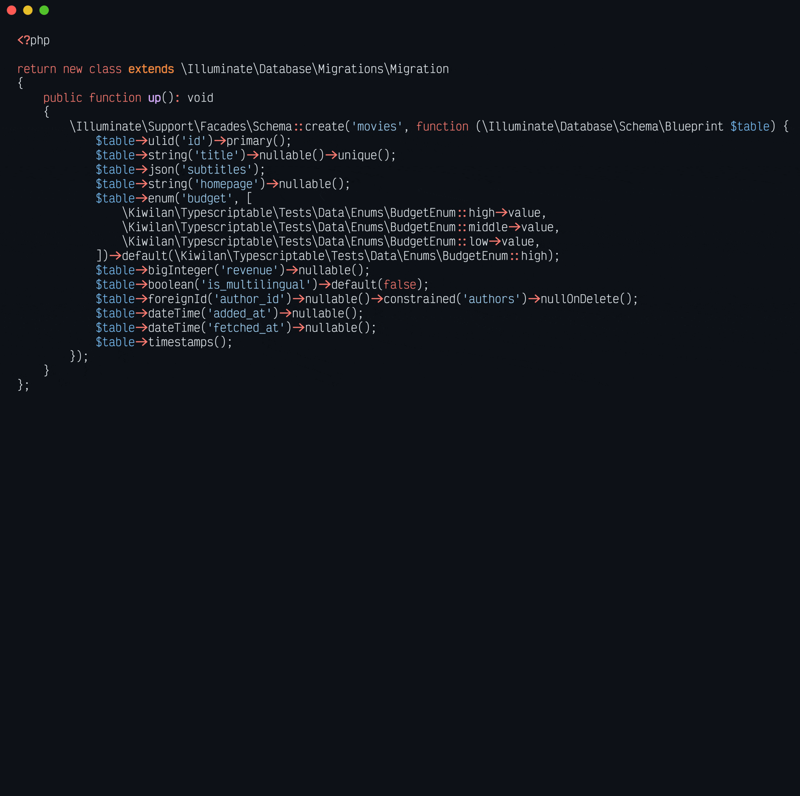

# Typescriptable for Laravel


[![php][php-version-src]][php-version-href]
[![version][version-src]][version-href]
[![downloads][downloads-src]][downloads-href]
[![license][license-src]][license-href]
[![codecov][codecov-src]][codecov-href]
[![tests][tests-src]][tests-href]

[![laravel][laravel-src]][laravel-href]
[![npm][npm-version-src]][npm-version-href]

PHP package for Laravel to type [**Eloquent models**](https://laravel.com/docs/master/eloquent), [**routes**](https://laravel.com/docs/master/routing), [**Spatie Settings**](https://github.com/spatie/laravel-settings) with **autogenerated TypeScript**.

If you want to use some helpers with [Inertia](https://inertiajs.com/), you can install [associated NPM package](#about-npm-package-kiwilantypescriptable-laravel).


> Because you need PHP and Typescript.

## Features

-   💽 Supported Laravel drivers: MySQL, MariaDB, PostgreSQL, SQLite, SQL Server, [MongoDB](https://github.com/mongodb/laravel-mongodb)
-   💬 Generate TS types for [Eloquent models](https://laravel.com/docs/master/eloquent)
-   👭 Generate TS types for [Eloquent relations](https://laravel.com/docs/master/eloquent-relationships)
-   🪄 Generate TS types for [`casts`](https://laravel.com/docs/master/eloquent-mutators#attribute-casting) (include native `enum` support)
-   📝 Generate TS types for `appends` and all [`accessors`](https://laravel.com/docs/master/eloquent-mutators#accessors-and-mutators)
    -   `Illuminate\Database\Eloquent\Casts\Attribute` with PHPDoc
    -   [`get*Attribute`](https://laravel.com/docs/8.x/eloquent-mutators#defining-an-accessor) methods
-   #️⃣ Generate TS types for `counts`
-   📖 Can generate pagination TS types for [Laravel pagination](https://laravel.com/docs/master/pagination)
-   💾 Can generate simple PHP classes from Eloquent models
-   ⚙️ Generate TS types for [`spatie/laravel-settings`](https://github.com/spatie/laravel-settings)
-   🛣 Generate TS types for [Laravel routes](https://laravel.com/docs/master/routing)
    -   Scan route parameters
    -   For Inertia, you can install [`@kiwilan/typescriptable-laravel`](https://github.com/kiwilan/typescriptable-laravel/blob/main/plugin/README.md) NPM package to use some helpers
-   ✅ Multiple commands to generate types
    -   `php artisan typescriptable` for models, settings and routes (safe even if you don't use all)
    -   `php artisan typescriptable:eloquent` for Eloquent models
    -   `php artisan typescriptable:settings` for `spatie/laravel-settings`
    -   `php artisan typescriptable:routes` for Laravel routes

### Roadmap

-   [ ] Add parser for [calebporzio/sushi](https://github.com/calebporzio/sushi)
-   [ ] Add parser for [spatie/laravel-permission](https://github.com/spatie/laravel-permission)

## Installation

This version requires [PHP](https://www.php.net/) `8.2+` and supports [Laravel](https://laravel.com/) 11.

> [!WARNING]
>
> Laravel 11 dropped [Doctrine DBAL](https://laravel.com/docs/11.x/upgrade#doctrine-dbal-removal). For previous Laravel versions, you can use `1.12.03` version.

| Version                                                                           | L9                 | L10                | L11                |
| --------------------------------------------------------------------------------- | ------------------ | ------------------ | ------------------ |
| [v1.12.03](https://packagist.org/packages/kiwilan/typescriptable-laravel#1.12.03) | :white_check_mark: | :white_check_mark: | :x:                |
| [v3+](https://packagist.org/packages/kiwilan/typescriptable-laravel)              | :x:                | :x:                | :white_check_mark: |

You can install the package via composer:

With **Laravel v11+** and PHP `8.2`

```bash
composer require kiwilan/typescriptable-laravel
```

With **Laravel v9-10** and PHP `8.1`

```
composer require kiwilan/typescriptable-laravel:1.12.03
```

### About TypeScript

If you want to use `.d.ts` files, you need to use TypeScript in your Laravel project, you have to create a `tsconfig.json` file and add `.d.ts` paths in `include`:

> [!NOTE]
>
> If you change paths into config or with options, adapt paths.

```jsonc
{
    "compilerOptions": {
        "types": ["vite/client"]
    },
    "include": [
        "resources/js/**/*.ts",
        "resources/js/**/*.d.ts",
        "resources/js/**/*.vue", // If you use Vue
        "*.d.ts",
        "vite.config.ts"
    ]
}
```

<details>
  <summary>Complete `tsconfig.json`</summary>

Here is a complete `tsconfig.json` file example (you can adapt paths):

```json
{
    "compilerOptions": {
        "target": "esnext",
        "jsx": "preserve",
        "module": "ESNext",
        "moduleResolution": "Node",
        "paths": {
            "@/*": ["./resources/js/*"],
            "@": ["./resources/js"],
            "~": ["./"],
            "~/*": ["./*"]
        },
        "types": ["vite/client"],
        "allowJs": true,
        "strict": true,
        "noEmit": true,
        "esModuleInterop": true,
        "forceConsistentCasingInFileNames": true,
        "isolatedModules": true,
        "skipLibCheck": true
    },
    "include": [
        "resources/js/**/*.ts",
        "resources/js/**/*.d.ts",
        "resources/js/**/*.vue",
        "*.d.ts",
        "vite.config.ts"
    ]
}
```

</details>

### About NPM package `@kiwilan/typescriptable-laravel`

NPM package is fully optional, you can use only PHP package. It's built for [Vite](https://vitejs.dev/) with [`laravel-vite-plugin`](https://github.com/laravel/vite-plugin) and [Inertia](https://inertiajs.com/) (only for [Vue 3](https://vuejs.org/)). It's SSR compatible.

This package add some helpers to use **Laravel routes** fully typed with TypeScript into Vue components and some composables to use with Vue. The best setup to install this package is to use [Jetstream](https://jetstream.laravel.com), a Laravel starter kit and [`tightenco/ziggy`](https://github.com/tighten/ziggy) is required.

Read full documentation here: [`@kiwilan/typescriptable-laravel`](https://github.com/kiwilan/typescriptable-laravel/blob/main/plugin/README.md).

## Configuration

You can publish the config file

```bash
php artisan vendor:publish --tag="typescriptable-config"
```

A config example is available here: [config/typescriptable.php](https://github.com/kiwilan/typescriptable-laravel/blob/main/config/typescriptable.php).

> [!IMPORTANT]
>
> You can configure `engine.eloquent` with `artisan` or `parser` to change parser engine. By default, it uses `artisan` command with [`model:show`](https://blog.laravel.com/laravel-new-model-show-command) command. `artisan` is default engine because it's more reliable and faster than `parser` engine. With MongoDB, the engine doesn't matter because MongoDB database can't be parsed like relational databases.

## Usage

```bash
php artisan typescriptable
```

With options:

-   --`M`|`models`: Generate Models types.
-   --`R`|`routes`: Generate Routes types.
-   --`S`|`settings`: Generate Settings types.

### Eloquent models

Generate `resources/js/types-eloquent.d.ts` file with all models types.

```bash
php artisan typescriptable:eloquent
```

### Spatie Settings

If you use [`spatie/laravel-settings`](https://github.com/spatie/laravel-settings), you can generate `resources/js/types-settings.d.ts` file with all settings types.

```bash
php artisan typescriptable:settings
```

### Routes

Generate `resources/js/types-routes.d.ts` file with all routes types and `resources/js/routes.ts` for routes references.

```bash
php artisan typescriptable:routes
```

### Eloquent listing

Show all Eloquent models with `eloquent:list` command.

```bash
php artisan eloquent:list
```

## Advanced

### MongoDB

`kiwilan/typescriptable-laravel` supports [MongoDB](https://github.com/mongodb/laravel-mongodb) with `mongodb/laravel-mongodb`. Due to the MongoDB structure, Typescript conversion aren't the same as SQL databases, precision is lower. If you want to improve it, you can add [an issue](https://github.com/kiwilan/typescriptable-laravel/issues/new/choose).

Database isn't parsed like with relational databases. The package will parse `key`, `fillable` and `hidden` to get all fields. If some fields are missing, you can [override them manually](https://github.com/kiwilan/typescriptable-laravel#override-models). All relations and accessors are supported.

### Database prefix

You can use `prefix` variable into `config/database.php` file.

```php
'connections' => [
    'YOUR_DATABASE_CONNECTION' => [
        'prefix' => '',
    ],
],
```

### Override models

`kiwilan/typescriptable-laravel` will cover many cases, but if you want to override some models, you can just create a type like `resources/js/types/index.ts` and extends `Model` type.

```ts
export interface BookAdvanced extends App.Models.Book {
    pivot: {
        created_at: string;
        updated_at: string;
    };
}
```

And you can import custom type in your code when you need to use advanced type.

```vue
<script setup lang="ts">
import { ref } from "vue";
import { BookAdvanced } from "@/types";

const book = ref<BookAdvanced>();
</script>
```

### Print PHP classes

If you want to print PHP classes, you can use `--php-path` option with `php artisan typescriptable:eloquent` command.

```bash
php artisan typescriptable:eloquent --php-path=app/print
```

These classes will be generated from Eloquent models as real PHP classes.

### Examples

Check [examples](docs/examples.md) documentation.



### Testing

Create a `.env` file with your database configuration

```bash
cp .env.example .env
```

And you can run tests

```bash
composer test
```

> [!NOTE]
>
> You can check [this gist](https://gist.github.com/ewilan-riviere/101cb03ee381b0adc2a22826d84e7577) to have a Docker database configuration.

## Changelog

Please see [CHANGELOG](CHANGELOG.md) for more information on what has changed recently.

## Credits

-   [Spatie](https://github.com/spatie): for [`spatie/package-skeleton-laravel`](https://github.com/spatie/package-skeleton-laravel)
-   [Ewilan Riviere](https://github.com/ewilan-riviere): Author package

## License

The MIT License (MIT). Please see [License File](LICENSE.md) for more information.

[](https://github.com/kiwilan)

[version-src]: https://img.shields.io/packagist/v/kiwilan/typescriptable-laravel.svg?style=flat-square&colorA=18181B&colorB=777BB4
[version-href]: https://packagist.org/packages/kiwilan/typescriptable-laravel
[php-version-src]: https://img.shields.io/static/v1?style=flat-square&label=PHP&message=v8.1&color=777BB4&logo=php&logoColor=ffffff&labelColor=18181b
[php-version-href]: https://www.php.net/
[npm-version-src]: https://img.shields.io/npm/v/@kiwilan/typescriptable-laravel.svg?style=flat-square&color=CB3837&logoColor=ffffff&labelColor=18181b
[npm-version-href]: https://www.npmjs.com/package/@kiwilan/typescriptable-laravel
[downloads-src]: https://img.shields.io/packagist/dt/kiwilan/typescriptable-laravel.svg?style=flat-square&colorA=18181B&colorB=777BB4
[downloads-href]: https://packagist.org/packages/kiwilan/typescriptable-laravel
[license-src]: https://img.shields.io/github/license/kiwilan/typescriptable-laravel.svg?style=flat-square&colorA=18181B&colorB=777BB4
[license-href]: https://github.com/kiwilan/typescriptable-laravel/blob/main/README.md
[tests-src]: https://img.shields.io/github/actions/workflow/status/kiwilan/typescriptable-laravel/run-tests.yml?branch=main&label=tests&style=flat-square&colorA=18181B
[tests-href]: https://github.com/kiwilan/typescriptable-laravel/actions/workflows/run-tests.yml
[codecov-src]: https://codecov.io/gh/kiwilan/typescriptable-laravel/branch/main/graph/badge.svg?token=P9XIK2KV9G
[codecov-href]: https://codecov.io/gh/kiwilan/typescriptable-laravel
[laravel-src]: https://img.shields.io/static/v1?label=Laravel&message=v9-11&style=flat-square&colorA=18181B&colorB=FF2D20
[laravel-href]: https://laravel.com
